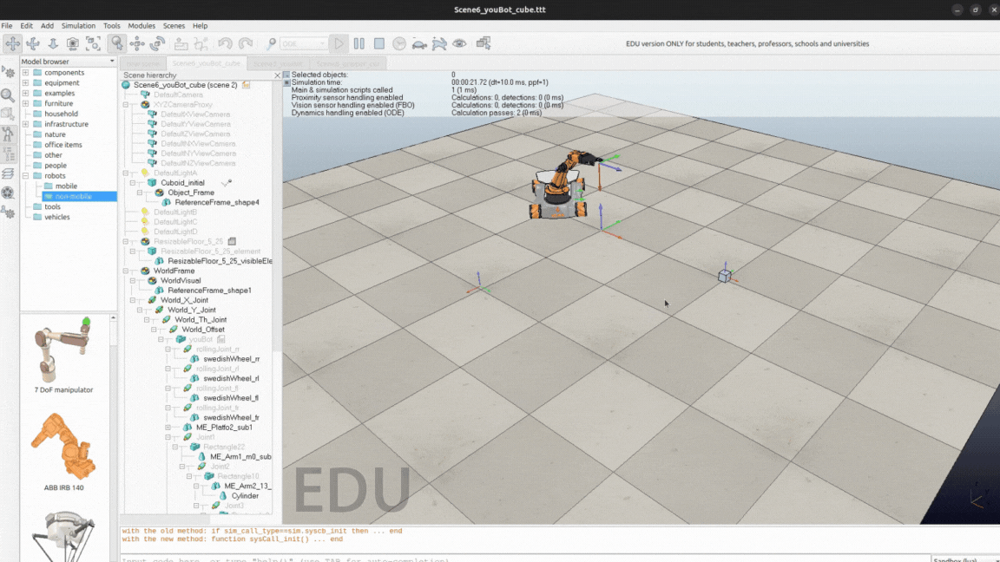
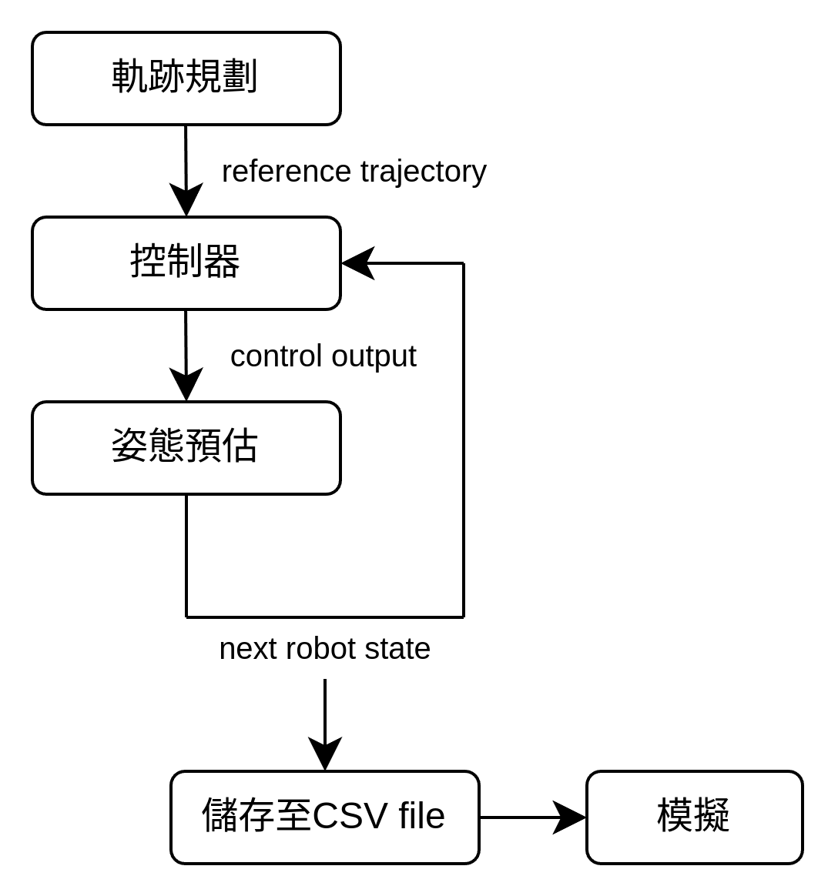
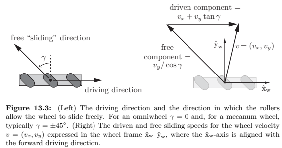
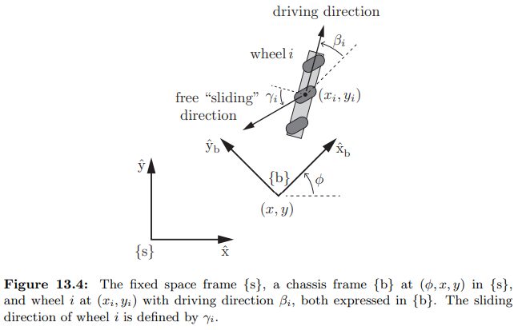
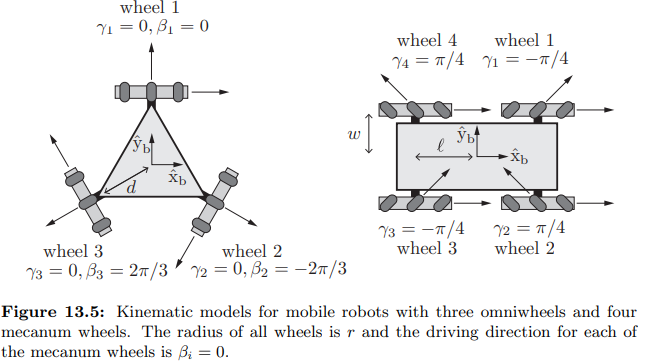

- [Mobile manipulation](#mobile-manipulation)
  - [簡介](#簡介)
  - [姿態預估](#姿態預估)
    - [里程計](#里程計)
      - [youBot底座運動學](#youbot底座運動學)
      - [里程計推導](#里程計推導)
    - [youBot手臂關節角度更新](#youbot手臂關節角度更新)
    - [實作](#實作)
  - [軌跡規劃](#軌跡規劃)
  - [控制器](#控制器)
  - [整合](#整合)
  - [結語](#結語)
  - [參考資料](#參考資料)


# Mobile manipulation 

## 簡介

Mobile manipulation是[ModernRobotics](https://www.coursera.org/specializations/modernrobotics)線上課程的專題。這篇文章是筆者用於紀錄以及分享專題的實作，希望能達到拋磚引玉效果，
如果內文有不正確的部份，再請隨時告知。

Mobile manipulation是協調基座與機器手臂之間的運動，使得末端執行器能實現期望的運動。在這個專題中，我們會使用KUKA youBot並在CoppeliaSim內模擬"抓取-放置"任務:



在這個專題中，會用到這些工具:

* python以及[modern-robotics](https://pypi.org/project/modern-robotics/) library
* CoppeliaSim, 並利用課程事先建立好的模擬環境，可以參考這個[連結](https://hades.mech.northwestern.edu/index.php/Mobile_Manipulation_Capstone)

而任務的流程圖如下所示:

{ width=600px }

1. *軌跡規劃*產生參考姿態
2. *控制器*依照參考姿態以及*里程計*的預估姿態產生控制輸出
3. *姿態預估*依照控制輸出計算youBot姿態 (假設可以完美地依照控制輸出去計算姿態)
4. 過程中得到的youBot姿態會被儲存至CSV檔案
5. 軟體讀取CSV檔案，模擬youBot的動作

接下來會分別介紹:

* [姿態預估](#姿態預估): 簡介youBot底座運動學，里程計
* [軌跡規劃](#軌跡規劃): 簡介軌跡規劃，如何設定路徑去夾取方塊
* [控制器](#控制器): 簡介前饋(feedforward)與反饋(feedback)控制器，如何依照期望的軌跡去產生youBot的驅動

並在最後的[整合](#整合)章節串連上述各個章節的結果，展示軟體模擬的結果，接下來就讓我們開始第一個章節吧。

## 姿態預估

youBot是由4個麥克納姆輪的底座加上5軸機械手臂所組成，*姿態預估*會依照*控制器*計算的關節速度去預測youBot的姿態(假設可以完美的進行預測)。*姿態預估*使用*里程計*以及first-order euler step進行計算。

在開始介紹相關公式之前，這裡先定義一些數學符號以及他們的意義:

|符號|意義|
|---|---|
|{$s$}|水平面上固定的空間座標系|
|{$b$}|固定在youBot底盤上的座標系|
|$q=(\phi, x, y)$|youBot底盤在空間座標系的位置|
|$V_b=(w_{bz}, v_{bx}, y_{by})$|在座標系{$b$}的底盤速度|
|$u$|輪子的驅動角速度(連接輪子的馬達轉速)|
|$r$|輪子的半徑|
|$\gamma$|輪子滑動時的角度|

### 里程計

里程計(odomery)是根據底座輪子運動去估算$q$，基本上是對車輪速度進行積分。里程計便宜且方便，但是它會隨著: 車輪滑動、地面平坦度等因素而產生誤差，因此會和其他感測器(Ex: Lidar)一起使用去彌補
里程計產生的誤差。(這裡假設模擬環境、youBot的運動是完美的，因此不會考慮里程計的誤差)

在介紹里程計的計算之前，我們需要了解youBot底座的運動學，那就讓我們開始吧～

#### youBot底座運動學

youBot的底盤使用4個麥克納姆輪去產生任意方向的速度，麥克納姆輪的示意圖如下所示:

{ width=600px }

*MODERN ROBOTICS MECHANICS, PLANNING, AND CONTROL” by Kevin M. Lynch and Frank C. Park.*

圖中的$\hat{x}_w$和$\hat{y}_w$是位於車輪中心的座標系。我們推導單一個輪子的驅動速度$u$與車輪中心的線速度$v=(v_x,v_y)$之間的關係

$$
\begin{aligned}
\begin{bmatrix}
v_x \\
v_y
\end{bmatrix}
= v_{drive}
\begin{bmatrix}
1 \\
0
\end{bmatrix}
+ v_{slide}
\begin{bmatrix}
-\sin{\gamma} \\
\cos{\gamma}
\end{bmatrix}
\end{aligned}
$$

$v_{drive}$是輪子的驅動速度，而$v_{slide}$是輪子因驅動速度產生的滑動速度。

將上面的公式做移項處理，可以將$v_{drive}$, $v_{slide}$用$v_x$, $v_y$表示，並且得到$u$:

$$
\begin{aligned}
v_{drive} & = v_x + v_y \tan{\gamma} \\
v_{slide} & = \frac{v_y}{\cos{\gamma}} \\
u & = \frac{v_{drive}}{r} = \frac{1}{r}(v_x + v_y\tan{\gamma})
\end{aligned}
$$

知道輪子中心的速度$v$與輪子驅動速度$u$之間的關係後，我們可以利用座標轉換的方式推導$u_i$與$\dot{q}$之間的關係: $u_i=h(\phi)\dot{q}$

{ width=600px }

*MODERN ROBOTICS MECHANICS, PLANNING, AND CONTROL” by Kevin M. Lynch and Frank C. Park.*

先將$\dot{q}$轉換成$V_b$:

$$
\begin{aligned}
V_b & = 
\begin{bmatrix}
1 & 0 & 0 \\
0 & \cos{\phi} & \sin{\phi} \\
0 & -\sin{\phi} & \cos{\phi}
\end{bmatrix}
\dot{q} \\
\begin{bmatrix}
w_{bz} \\ 
v_{bx} \\ 
y_{by}
\end{bmatrix} & =
\begin{bmatrix}
1 & 0 & 0 \\
0 & \cos{\phi} & \sin{\phi} \\
0 & -\sin{\phi} &  \cos{\phi}
\end{bmatrix}
\begin{bmatrix}
\dot{\phi} \\ 
\dot{x} \\ 
\dot{y} 
\end{bmatrix}
\end{aligned}
$$

接下來，我們找出在{$b$}座標系，底盤以$V_b$進行移動時，輪子中心速度$v_{wheel}$: (公式內使用到cross product進行計算，可以想像成輪子中心距離{b}座標系會受到$w_{bz}$的影響而產生線速度)

$$
\begin{aligned}
v_{wheel} & = 
w_{bz}\hat{k} \times 
\begin{bmatrix}
x_i \\
y_i \\
0
\end{bmatrix}
+ 
\begin{bmatrix}
v_{bx} \\
v_{by} \\
0
\end{bmatrix} \\
& = 
\begin{bmatrix}
-y_i & 1 & 0 \\
x_i & 0 & 1
\end{bmatrix}
\begin{bmatrix}
w_{bz} \\
v_{bx} \\
v_{by}
\end{bmatrix}
+
\begin{bmatrix}
v_{bx} \\
v_{by} \\
0
\end{bmatrix}
\end{aligned}
$$

上述得到的輪子中心速度$v_{wheel}$是在{$b$}座標系，我們進一步把它轉換至輪子中心座標系$\hat{x}_w$-$\hat{y}_w$去求$v$:

$$
\begin{aligned}
v = 
\begin{bmatrix}
\cos{\beta_i} & \sin{\beta_i} \\
-\sin{\beta_i} & \cos{\beta_i}
\end{bmatrix}
\begin{bmatrix}
v_{x} \\
v_{y}
\end{bmatrix}
\end{aligned}
$$

再使用一開始$u$與$v$的變換，就可以得到驅動速度$u_i$了:

$$
\begin{aligned}
u_i =  
\begin{bmatrix}
\frac{1}{r_i} & \frac{\tan{\gamma_i}}{r_i}
\end{bmatrix}
v
\end{aligned}
$$

最後將上述的結果進行整理，可以求得$h_i(\phi)$:

$$
\begin{aligned}
u_i & = h_i(\phi)\dot{q} \\
& = 
\begin{bmatrix}
\frac{1}{r_i} & \frac{\tan{\gamma_i}}{r_i}
\end{bmatrix}
\begin{bmatrix}
\cos{\beta_i} & \sin{\beta_i} \\
-\sin{\beta_i} & \cos{\beta_i}
\end{bmatrix}
\begin{bmatrix}
-y_i & 1 & 0 \\
x_i & 0 & 1
\end{bmatrix}
\begin{bmatrix}
1 & 0 & 0 \\
0 & \cos{\phi} & \sin{\phi} \\
0 & -\sin{\phi} &  \cos{\phi}
\end{bmatrix}
\begin{bmatrix}
\dot{\phi} \\ 
\dot{x} \\ 
\dot{y} 
\end{bmatrix} \\
& = \frac{1}{r_i\cos{\gamma_i}}
\begin{bmatrix}
x_i\sin(\beta_i+\gamma_i) - y_i\cos(\beta_i+\gamma_i) \\
\cos(\beta_i+\gamma_i+\phi) \\
\sin(\beta_i+\gamma_i+\phi) 
\end{bmatrix}^T
\begin{bmatrix}
\dot{\phi} \\ 
\dot{x} \\ 
\dot{y} 
\end{bmatrix}
\end{aligned}
$$

上述的$h_i(\phi)$表示$u$與$\dot{q}$之間的關係，我們可以進一步把$\phi$設定成0，表示$u$與$V_b$之間的關係。如此一來，利用$h_i(0)$，我們可以利用下圖右側的參數，建立youBout底盤的運動學:

{ width=600px }

*MODERN ROBOTICS MECHANICS, PLANNING, AND CONTROL” by Kevin M. Lynch and Frank C. Park.*

$$
\begin{aligned}
u & = H(0)
\begin{bmatrix}
h_1(0) \\ 
h_2(0) \\ 
h_3(0) \\
h_4(0) 
\end{bmatrix} 
V_b \\
& = \frac{1}{r}
\begin{bmatrix}
-\ell - w & 1 & -1 \\ 
 \ell + w & 1 & 1 \\ 
 \ell + w & 1 & -1 \\ 
-\ell - w & 1 & 1
\end{bmatrix}
\begin{bmatrix}
w_{bz} \\
v_{bx} \\
v_{by}
\end{bmatrix}
\end{aligned}
$$

由於youBot底盤有4個輪子，我們依序堆疊$h_i(0)$去建立$V_b \to u$的公式。如果要計算$u \to V_b$，則可以進行逆矩陣的計算:

$$
\begin{aligned}
V_b & = \frac{r}{4}
\begin{bmatrix}
\frac{-1}{\ell+w} & \frac{1}{\ell+w} & \frac{1}{\ell+w} & \frac{-1}{\ell+w} \\ 
1 & 1 & 1 & 1 \\ 
-1 & 1 & -1 & 1
\end{bmatrix} 
u
\end{aligned}
$$

這樣我們就完成了youBot底盤運動學的推導

#### 里程計推導

得到youBot底盤運動學之後，我們開始推導里程計的計算公式。我們考慮從時間$k$到$k + 1$的車輪角度變化，目標是以先前的底盤姿態$q_k$來計算新的底盤姿態$q_{k + 1}$。

我們假設輪子在時間間隔內是固定的，並且設$\Delta{\theta}$為時間間隔的角度變化，則車輪速度為$\dot{\theta} = \frac{\Delta{\theta}}{\Delta{t}}$。利用底盤運動學的$u \to V_b$，
可以得到:

$$
\begin{aligned}
V_b & = F\dot{\theta} \\
    & = \frac{r}{4\Delta{t}}
\begin{bmatrix}
\frac{-1}{\ell+w} & \frac{1}{\ell+w} & \frac{1}{\ell+w} & \frac{-1}{\ell+w} \\ 
1 & 1 & 1 & 1 \\ 
-1 & 1 & -1 & 1
\end{bmatrix} 
\Delta{\theta}
\end{aligned}
$$

這樣可以對$V_b$在時間間隔內進行計算，得到$\Delta{\theta}$產生的姿態變化$\Delta{q_b} = (\Delta{\phi_b}, \Delta{x_b}, \Delta{y_b})$:

$$
\begin{aligned}
V_b & = (w_{bz}, v_{bx}, v_{by}) \\
w_{bz} & = 0, \Delta{q_b} = 
\begin{bmatrix}
0 \\
v_{bx}\Delta{t} \\
v_{by}\Delta{t}
\end{bmatrix} \\
w_{bz} & \not ={0}, \Delta{q_b} = 
\begin{bmatrix}
w_{bz}\Delta{t} \\
\frac{v_{bx}\sin{w_{bz}\Delta{t}} + v_{by}(\cos{w_{bz}\Delta{t}} - 1)}{w_{bz}\Delta{t}} \\
\frac{v_{by}\sin{w_{bz}\Delta{t}} + v_{bx}(1 - \cos{w_{bz}\Delta{t}})}{w_{bz}\Delta{t}}
\end{bmatrix}
\end{aligned}
$$

將$(w_{bz}, v_{bx}, v_{by})$進行置換:

$$
\begin{aligned}
v_{bx} & = \hat{v}_{bx} = \frac{(F\Delta{\theta})_x}{\Delta{t}}, 
v_{by} = \hat{v}_{by} =  \frac{(F\Delta{\theta})_y}{\Delta{t}}
w_{bz} = \hat{w}_{bz} =  \frac{(F\Delta{\theta})_z}{\Delta{t}} \\
w_b & = 0, \Delta{q_b} = 
\begin{bmatrix}
0 \\
\hat{v}_{bx} \\
\hat{v}_{by}
\end{bmatrix} \\
w_b & \not ={0}, \Delta{q_b} = 
\begin{bmatrix}
\hat{w}_{bz} \\
\frac{v_{bx}\sin{\hat{w}_{bz}} + v_{by}(\cos{\hat{w}_{bz}} - 1)}{\hat{w}_{bz}} \\
\frac{v_{by}\sin{\hat{w}_{bz}} + v_{bx}(1 - \cos{\hat{w}_{bz}})}{\hat{w}_{bz}}
\end{bmatrix}
\end{aligned}
$$

由此可見，$\Delta{t}$的單位選擇並不重要，我們可以直接利用$F\Delta{\theta}$與上述公式更新$\Delta{q_b}$。

最後，可以利用底盤的角度$\phi_k$將{$b$}座標系中的$\Delta{q_b}$轉換至{$s$}座標系中的$\Delta{q}$並更新里程計的估計值:

$$
\begin{aligned}
\Delta_q & = \begin{bmatrix}
1 & 0 & 0 \\
0 & \cos{\phi_k} & -\sin{\phi_k} \\
0 & \sin{\phi_k} & \cos{\phi_k}
\end{bmatrix}
\Delta{q_b} \\
q_{k + 1} & = q_k + \Delta{q_b}
\end{aligned}
$$

### youBot手臂關節角度更新

由於我們使用first-order euler step進行計算，將手臂的關節從時刻$k$更新至時刻$k + 1$的方式如下:

$$
\begin{aligned}
joint_k = joint_{k + 1} + \dot{\theta}\Delta{t}
\end{aligned}
$$

### 實作

讓我們以python去實作里程計以及youBot手臂關節角度的更新吧。我們會將計算式包裝在一個`Odometry` class並使用`next_state` function去更新姿態。

我們先做出`Odometry` class，並定義底盤運動學的$F$矩陣(機構參數可以[參考](https://hades.mech.northwestern.edu/index.php/Mobile_Manipulation_Capstone))

```python
class Odometry:
    def __init__(self):
        w = 0.15
        l = 0.235
        r = 0.0475

        self.F = (r / 4) * np.array([
            [-1 / (l + w), 1 / (l + w), 1 / (l + w), -1 / (l + w)],
            [1, 1, 1, 1],
            [-1, 1, -1, 1]
        ])
```

接著我們做出`next_state`吧(為了避免篇幅過長，以下簡述較為重要的部分):

```python
def next_state(self, curr_config: list[float], speed: list[float], dt: float, max_speed: float = 1e9) -> list[float]:
  """
  ## Description

  Calculate next robot state

  ## Input

  1. 12-vector representing the current configuration of the robot:
      * 3 variables for chassis configuration
      * 5 variables for arm configuration
      * 4 variables for wheel angels
  2. 9-vector of controls indicating the wheel speeds and joint speeds
      * 5 variables for arm speed
      * 4 variables for base speed
  3. Timestep, dt
  4. A positive real value indicating the maximum angular speed of the arm joints and the wheels
      * By default, it is set to a large value
  ## Output

  1. A 12-vector representing the configuration of the robot after dt:
     chassis phi, chassis x, chassis y, J1, J2, J3, J4, J5, W1, W2, W3, W4
  """
  
  # 手臂角度更新
  delta_joint_theta = dt * joint_theta_dot
  next_joint_angles = curr_joint_angles + delta_joint_theta

  # 底盤odometry計算
  delta_wheel_theta = dt * wheel_theta_dot
  next_wheel_angles = curr_wheel_angles + delta_wheel_theta

  V_b = self.F @ delta_wheel_theta

  wbz = V_b[0][0]
  vbx = V_b[1][0]
  vby = V_b[2][0]

  if wbz == 0.0:
      delta_qb = np.array([
          [0],
          [vbx],
          [vby]
      ])
  else:
      delta_qb = np.array([
          [wbz],
          [(vbx * math.sin(wbz) + vby * (math.cos(wbz) - 1)) / wbz],
          [(vby * math.sin(wbz) + vbx * (1 - math.cos(wbz))) / wbz]
      ])

  transform = np.array([
      [1, 0, 0],
      [0, math.cos(curr_config[0]), -math.sin(curr_config[0])],
      [0, math.sin(curr_config[0]), math.cos(curr_config[0])],
  ])

  delta_q = transform @ delta_qb
  q_k_1 = q_k + delta_q

  return ...
```

上述便是程式實作的部分，細節可以參考這份[!TODO!](!TODO!)

## 軌跡規劃

todo 

## 控制器

todo 

## 整合

todo

## 結語

todo

## 參考資料

1. [MODERN ROBOTICS MECHANICS, PLANNING, AND CONTROL](https://hades.mech.northwestern.edu/images/2/2e/MR-largefont-v2.pdf)
2. [Mobile Manipulation Project Description](https://hades.mech.northwestern.edu/index.php/Mobile_Manipulation_Capstone)
