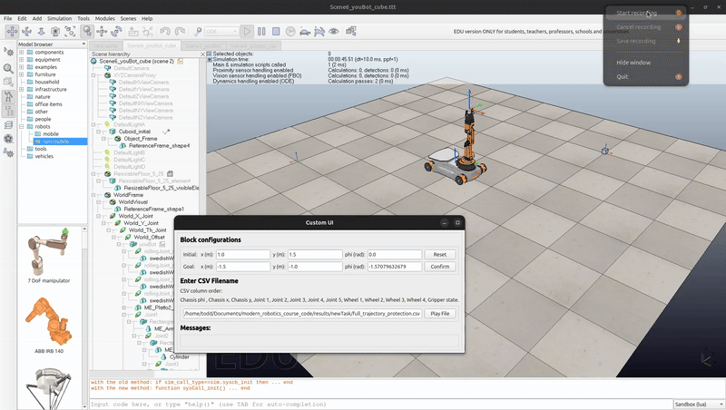

- [Mobile manipulation](#mobile-manipulation)
  - [簡介](#簡介)
  - [姿態預估](#姿態預估)
    - [里程計](#里程計)
      - [youBot底座運動學](#youbot底座運動學)
      - [里程計推導](#里程計推導)
    - [youBot手臂關節角度更新](#youbot手臂關節角度更新)
    - [實作](#實作)
  - [軌跡規劃](#軌跡規劃)
    - [軌跡定義](#軌跡定義)
      - [三次多項式](#三次多項式)
    - [構型空間的路徑](#構型空間的路徑)
    - [軌跡模擬](#軌跡模擬)
  - [控制器](#控制器)
    - [主函式](#主函式)
  - [整合](#整合)
    - [主函式](#主函式-1)
    - [模擬結果](#模擬結果)
  - [結語](#結語)
  - [參考資料](#參考資料)


# Mobile manipulation 

## 簡介

Mobile manipulation是[ModernRobotics](https://www.coursera.org/specializations/modernrobotics)線上課程的專題。這篇文章是筆者用於紀錄以及分享專題的實作，希望能達到拋磚引玉效果，
如果內文有不正確的部份，再請隨時告知。

Mobile manipulation是協調基座與機器手臂之間的運動，使得末端執行器能實現期望的運動。在這個專題中，我們會使用KUKA youBot並在CoppeliaSim內模擬"抓取-放置"任務:


在這個專題中，會用到這些工具:

* python以及[modern-robotics](https://pypi.org/project/modern-robotics/) library
* CoppeliaSim, 並利用課程事先建立好的模擬環境，可以參考這個[連結](https://hades.mech.northwestern.edu/index.php/Mobile_Manipulation_Capstone)

而任務的流程圖如下所示:

{ width=600px }

1. *軌跡規劃*產生參考姿態
2. *控制器*依照參考姿態以及*里程計*的預估姿態產生控制輸出
3. *姿態預估*依照控制輸出計算youBot姿態 (假設可以完美地依照控制輸出去計算姿態)
4. 過程中得到的youBot姿態會被儲存至CSV檔案
5. 軟體讀取CSV檔案，模擬youBot的動作

接下來會分別介紹:

* [姿態預估](#姿態預估): 簡介youBot底座運動學，里程計
* [軌跡規劃](#軌跡規劃): 簡介軌跡規劃，如何設定路徑去夾取方塊
* [控制器](#控制器): 簡介前饋(feedforward)與反饋(feedback)控制器，如何依照期望的軌跡去產生youBot的驅動

並在最後的[整合](#整合)章節串連上述各個章節的結果，展示軟體模擬的結果，接下來就讓我們開始第一個章節吧。

## 姿態預估

youBot是由4個麥克納姆輪的底座加上5軸機械手臂所組成，*姿態預估*會依照*控制器*計算的關節速度去預測youBot的姿態(假設可以完美的進行預測)。*姿態預估*使用*里程計*以及first-order euler step進行計算。

在開始介紹相關公式之前，這裡先定義一些數學符號以及他們的意義:

|符號|意義|
|---|---|
|{$s$}|水平面上固定的空間座標系|
|{$b$}|固定在youBot底盤上的座標系|
|$q=(\phi, x, y)$|youBot底盤在空間座標系的位置|
|$V_b=(w_{bz}, v_{bx}, y_{by})$|在座標系{$b$}的底盤速度|
|$u$|輪子的驅動角速度(連接輪子的馬達轉速)|
|$r$|輪子的半徑|
|$\gamma$|輪子滑動時的角度|

### 里程計

里程計(odomery)是根據底座輪子運動去估算$q$，基本上是對車輪速度進行積分。里程計便宜且方便，但是它會隨著: 車輪滑動、地面平坦度等因素而產生誤差，因此會和其他感測器(Ex: Lidar)一起使用去彌補
里程計產生的誤差。(這裡假設模擬環境、youBot的運動是完美的，因此不會考慮里程計的誤差)

在介紹里程計的計算之前，我們需要了解youBot底座的運動學，那就讓我們開始吧～

#### youBot底座運動學

youBot的底盤使用4個麥克納姆輪去產生任意方向的速度，麥克納姆輪的示意圖如下所示:

{ width=600px }

*MODERN ROBOTICS MECHANICS, PLANNING, AND CONTROL” by Kevin M. Lynch and Frank C. Park.*

圖中的$\hat{x}_w$和$\hat{y}_w$是位於車輪中心的座標系。我們推導單一個輪子的驅動速度$u$與車輪中心的線速度$v=(v_x,v_y)$之間的關係

$$
\begin{aligned}
\begin{bmatrix}
v_x \\
v_y
\end{bmatrix}
= v_{drive}
\begin{bmatrix}
1 \\
0
\end{bmatrix}
+ v_{slide}
\begin{bmatrix}
-\sin{\gamma} \\
\cos{\gamma}
\end{bmatrix}
\end{aligned}
$$

$v_{drive}$是輪子的驅動速度，而$v_{slide}$是輪子因驅動速度產生的滑動速度。

將上面的公式做移項處理，可以將$v_{drive}$, $v_{slide}$用$v_x$, $v_y$表示，並且得到$u$:

$$
\begin{aligned}
v_{drive} & = v_x + v_y \tan{\gamma} \\
v_{slide} & = \frac{v_y}{\cos{\gamma}} \\
u & = \frac{v_{drive}}{r} = \frac{1}{r}(v_x + v_y\tan{\gamma})
\end{aligned}
$$

知道輪子中心的速度$v$與輪子驅動速度$u$之間的關係後，我們可以利用座標轉換的方式推導$u_i$與$\dot{q}$之間的關係: $u_i=h(\phi)\dot{q}$

{ width=600px }

*MODERN ROBOTICS MECHANICS, PLANNING, AND CONTROL” by Kevin M. Lynch and Frank C. Park.*

先將$\dot{q}$轉換成$V_b$:

$$
\begin{aligned}
V_b & = 
\begin{bmatrix}
1 & 0 & 0 \\
0 & \cos{\phi} & \sin{\phi} \\
0 & -\sin{\phi} & \cos{\phi}
\end{bmatrix}
\dot{q} \\
\begin{bmatrix}
w_{bz} \\ 
v_{bx} \\ 
v_{by}
\end{bmatrix} & =
\begin{bmatrix}
1 & 0 & 0 \\
0 & \cos{\phi} & \sin{\phi} \\
0 & -\sin{\phi} &  \cos{\phi}
\end{bmatrix}
\begin{bmatrix}
\dot{\phi} \\ 
\dot{x} \\ 
\dot{y} 
\end{bmatrix}
\end{aligned}
$$

接下來，我們找出在{$b$}座標系，底盤以$V_b$進行移動時，輪子中心速度$v_{wheel}$: (公式內使用到cross product進行計算，可以想像成輪子中心距離{b}座標系會受到$w_{bz}$的影響而產生線速度)

$$
\begin{aligned}
v_{wheel} & = 
w_{bz}\hat{k} \times 
\begin{bmatrix}
x_i \\
y_i \\
0
\end{bmatrix}
+ 
\begin{bmatrix}
v_{bx} \\
v_{by} \\
0
\end{bmatrix} \\
& = 
\begin{bmatrix}
-y_i & 1 & 0 \\
x_i & 0 & 1
\end{bmatrix}
\begin{bmatrix}
w_{bz} \\
v_{bx} \\
v_{by}
\end{bmatrix}
+
\begin{bmatrix}
v_{bx} \\
v_{by} \\
0
\end{bmatrix}
\end{aligned}
$$

上述得到的輪子中心速度$v_{wheel}$是在{$b$}座標系，我們進一步把它轉換至輪子中心座標系$\hat{x}_w$-$\hat{y}_w$去求$v$:

$$
\begin{aligned}
v = 
\begin{bmatrix}
\cos{\beta_i} & \sin{\beta_i} \\
-\sin{\beta_i} & \cos{\beta_i}
\end{bmatrix}
\begin{bmatrix}
v_{wheelx} \\
v_{wheely}
\end{bmatrix}
\end{aligned}
$$

再使用一開始$u$與$v$的變換，就可以得到驅動速度$u_i$了:

$$
\begin{aligned}
u_i =  
\begin{bmatrix}
\frac{1}{r_i} & \frac{\tan{\gamma_i}}{r_i}
\end{bmatrix}
v
\end{aligned}
$$

最後將上述的結果進行整理，可以求得$h_i(\phi)$:

$$
\begin{aligned}
u_i & = h_i(\phi)\dot{q} \\
& = 
\begin{bmatrix}
\frac{1}{r_i} & \frac{\tan{\gamma_i}}{r_i}
\end{bmatrix}
\begin{bmatrix}
\cos{\beta_i} & \sin{\beta_i} \\
-\sin{\beta_i} & \cos{\beta_i}
\end{bmatrix}
\begin{bmatrix}
-y_i & 1 & 0 \\
x_i & 0 & 1
\end{bmatrix}
\begin{bmatrix}
1 & 0 & 0 \\
0 & \cos{\phi} & \sin{\phi} \\
0 & -\sin{\phi} &  \cos{\phi}
\end{bmatrix}
\begin{bmatrix}
\dot{\phi} \\ 
\dot{x} \\ 
\dot{y} 
\end{bmatrix} \\
& = \frac{1}{r_i\cos{\gamma_i}}
\begin{bmatrix}
x_i\sin(\beta_i+\gamma_i) - y_i\cos(\beta_i+\gamma_i) \\
\cos(\beta_i+\gamma_i+\phi) \\
\sin(\beta_i+\gamma_i+\phi) 
\end{bmatrix}^T
\begin{bmatrix}
\dot{\phi} \\ 
\dot{x} \\ 
\dot{y} 
\end{bmatrix}
\end{aligned}
$$

上述的$h_i(\phi)$表示$u$與$\dot{q}$之間的關係，我們可以進一步把$\phi$設定成0，表示$u$與$V_b$之間的關係。如此一來，利用$h_i(0)$，我們可以利用下圖右側的參數，建立youBout底盤的運動學:

{ width=600px }

*MODERN ROBOTICS MECHANICS, PLANNING, AND CONTROL” by Kevin M. Lynch and Frank C. Park.*

$$
\begin{aligned}
u & = H(0)
\begin{bmatrix}
h_1(0) \\ 
h_2(0) \\ 
h_3(0) \\
h_4(0) 
\end{bmatrix} 
V_b \\
& = \frac{1}{r}
\begin{bmatrix}
-\ell - w & 1 & -1 \\ 
 \ell + w & 1 & 1 \\ 
 \ell + w & 1 & -1 \\ 
-\ell - w & 1 & 1
\end{bmatrix}
\begin{bmatrix}
w_{bz} \\
v_{bx} \\
v_{by}
\end{bmatrix}
\end{aligned}
$$

由於youBot底盤有4個輪子，我們依序堆疊$h_i(0)$去建立$V_b \to u$的公式。如果要計算$u \to V_b$，則可以進行逆矩陣的計算:

$$
\begin{aligned}
V_b & = \frac{r}{4}
\begin{bmatrix}
\frac{-1}{\ell+w} & \frac{1}{\ell+w} & \frac{1}{\ell+w} & \frac{-1}{\ell+w} \\ 
1 & 1 & 1 & 1 \\ 
-1 & 1 & -1 & 1
\end{bmatrix} 
u
\end{aligned}
$$

這樣我們就完成了youBot底盤運動學的推導

#### 里程計推導

得到youBot底盤運動學之後，我們開始推導里程計的計算公式。我們考慮從時間$k$到$k + 1$的車輪角度變化，目標是以先前的底盤姿態$q_k$來計算新的底盤姿態$q_{k + 1}$。

我們假設輪子在時間間隔內是固定的，並且設$\Delta{\theta}$為時間間隔的角度變化，則車輪速度為$\dot{\theta} = \frac{\Delta{\theta}}{\Delta{t}}$。利用底盤運動學的$u \to V_b$，
可以得到:

$$
\begin{aligned}
V_b & = F\dot{\theta} \\
    & = \frac{r}{4\Delta{t}}
\begin{bmatrix}
\frac{-1}{\ell+w} & \frac{1}{\ell+w} & \frac{1}{\ell+w} & \frac{-1}{\ell+w} \\ 
1 & 1 & 1 & 1 \\ 
-1 & 1 & -1 & 1
\end{bmatrix} 
\Delta{\theta}
\end{aligned}
$$

這樣可以對$V_b$在時間間隔內進行計算，得到$\Delta{\theta}$產生的姿態變化$\Delta{q_b} = (\Delta{\phi_b}, \Delta{x_b}, \Delta{y_b})$:

$$
\begin{aligned}
V_b & = (w_{bz}, v_{bx}, v_{by}) \\
w_{bz} & = 0, \Delta{q_b} = 
\begin{bmatrix}
0 \\
v_{bx}\Delta{t} \\
v_{by}\Delta{t}
\end{bmatrix} \\
w_{bz} & \not ={0}, \Delta{q_b} = 
\begin{bmatrix}
w_{bz}\Delta{t} \\
\frac{v_{bx}\sin{w_{bz}\Delta{t}} + v_{by}(\cos{w_{bz}\Delta{t}} - 1)}{w_{bz}\Delta{t}} \\
\frac{v_{by}\sin{w_{bz}\Delta{t}} + v_{bx}(1 - \cos{w_{bz}\Delta{t}})}{w_{bz}\Delta{t}}
\end{bmatrix}
\end{aligned}
$$

將$(w_{bz}, v_{bx}, v_{by})$進行置換:

$$
\begin{aligned}
v_{bx} & = \hat{v}_{bx} = \frac{(F\Delta{\theta})_x}{\Delta{t}}, 
v_{by} = \hat{v}_{by} =  \frac{(F\Delta{\theta})_y}{\Delta{t}}
w_{bz} = \hat{w}_{bz} =  \frac{(F\Delta{\theta})_z}{\Delta{t}} \\
w_{bz} & = 0, \Delta{q_b} = 
\begin{bmatrix}
0 \\
\hat{v}_{bx} \\
\hat{v}_{by}
\end{bmatrix} \\
w_{bz} & \not ={0}, \Delta{q_b} = 
\begin{bmatrix}
\hat{w}_{bz} \\
\frac{v_{bx}\sin{\hat{w}_{bz}} + v_{by}(\cos{\hat{w}_{bz}} - 1)}{\hat{w}_{bz}} \\
\frac{v_{by}\sin{\hat{w}_{bz}} + v_{bx}(1 - \cos{\hat{w}_{bz}})}{\hat{w}_{bz}}
\end{bmatrix}
\end{aligned}
$$

由此可見，$\Delta{t}$的單位選擇並不重要，我們可以直接利用$F\Delta{\theta}$與上述公式更新$\Delta{q_b}$。

最後，可以利用底盤的角度$\phi_k$將{$b$}座標系中的$\Delta{q_b}$轉換至{$s$}座標系中的$\Delta{q}$並更新里程計的估計值:

$$
\begin{aligned}
\Delta_q & = \begin{bmatrix}
1 & 0 & 0 \\
0 & \cos{\phi_k} & -\sin{\phi_k} \\
0 & \sin{\phi_k} & \cos{\phi_k}
\end{bmatrix}
\Delta{q_b} \\
q_{k + 1} & = q_k + \Delta{q_b}
\end{aligned}
$$

### youBot手臂關節角度更新

由於我們使用first-order euler step進行計算，將手臂的關節從時刻$k$更新至時刻$k + 1$的方式如下:

$$
\begin{aligned}
joint_k = joint_{k + 1} + \dot{\theta}\Delta{t}
\end{aligned}
$$

### 實作

讓我們以python去實作里程計以及youBot手臂關節角度的更新吧。我們會將計算式包裝在一個`Odometry` class並使用`next_state` function去更新姿態。

我們先做出`Odometry` class，並定義底盤運動學的$F$矩陣(機構參數可以[參考](https://hades.mech.northwestern.edu/index.php/Mobile_Manipulation_Capstone))

```python
class Odometry:
    def __init__(self):
        w = 0.15
        l = 0.235
        r = 0.0475

        self.F = (r / 4) * np.array([
            [-1 / (l + w), 1 / (l + w), 1 / (l + w), -1 / (l + w)],
            [1, 1, 1, 1],
            [-1, 1, -1, 1]
        ])
```

接著我們做出`next_state`吧(為了避免篇幅過長，以下簡述較為重要的部分):

```python
def next_state(self, curr_config: list[float], speed: list[float], dt: float, max_speed: float = 1e9) -> list[float]:
  """
  ## Description

  Calculate next robot state

  ## Input

  1. 12-vector representing the current configuration of the robot:
      * 3 variables for chassis configuration
      * 5 variables for arm configuration
      * 4 variables for wheel angels
  2. 9-vector of controls indicating the wheel speeds and joint speeds
      * 5 variables for arm speed
      * 4 variables for base speed
  3. Timestep, dt
  4. A positive real value indicating the maximum angular speed of the arm joints and the wheels
      * By default, it is set to a large value
  ## Output

  1. A 12-vector representing the configuration of the robot after dt:
     chassis phi, chassis x, chassis y, J1, J2, J3, J4, J5, W1, W2, W3, W4
  """
  
  # 手臂角度更新
  delta_joint_theta = dt * joint_theta_dot
  next_joint_angles = curr_joint_angles + delta_joint_theta

  # 底盤odometry計算
  delta_wheel_theta = dt * wheel_theta_dot
  next_wheel_angles = curr_wheel_angles + delta_wheel_theta

  V_b = self.F @ delta_wheel_theta

  wbz = V_b[0][0]
  vbx = V_b[1][0]
  vby = V_b[2][0]

  if wbz == 0.0:
      delta_qb = np.array([
          [0],
          [vbx],
          [vby]
      ])
  else:
      delta_qb = np.array([
          [wbz],
          [(vbx * math.sin(wbz) + vby * (math.cos(wbz) - 1)) / wbz],
          [(vby * math.sin(wbz) + vbx * (1 - math.cos(wbz))) / wbz]
      ])

  transform = np.array([
      [1, 0, 0],
      [0, math.cos(curr_config[0]), -math.sin(curr_config[0])],
      [0, math.sin(curr_config[0]), math.cos(curr_config[0])],
  ])

  delta_q = transform @ delta_qb
  q_k_1 = q_k + delta_q

  return ...
```

上述便是程式實作的部分，細節可以參考這份[檔案](https://github.com/chentodd/Mobile_Manipulation_Project/blob/main/code/odometry.py)

## 軌跡規劃

讓我們接著了解軌跡規劃吧，想看上一節**姿態預估**的讀者可以參考這個[連結](https://www.techchickensoup.com/chef-collection/mobile-manipulation-intro1/).

軌跡規劃用於指定機器人的任務，例如: 讓末端執行器跟蹤某一個已知的移動問題。對於專題內的youBot而言，它的任務是夾起方塊，並在指定的位置放下方塊。在這一節中，我們會簡介:
* 軌跡定義
* 軌跡模擬

那就讓我們開始吧～

### 軌跡定義

我們將路徑(path)定義為$\theta(s)$，其中$s$是scalar parameter並且在路徑起始處為0、末端處為1，$\theta(s)$會對應機器人構型空間$\Theta$中的一點: $\theta:[0, 1]\to\Theta$。
$s$可以隨著$t$變化，因此軌跡可以進一步定義成: $\theta(s(t))$，其中$t$是time scaling，表示: $s:[0, T]\to[0, 1]$。

簡介完軌跡定義之外，讓我們來看一個簡單的三次$s(t)$多項式吧:

#### 三次多項式

$s(t)$可以表示成: $s(t) = a_0 + a_1t + a_2t^2 + a_3t^3$。可以透過施加約束去求解係數: 
1. $s(0) = \dot{s}(0) = 0$
2. $s(T) = 1$, $\dot{s}(T) = 0$

利用上述的約束，可以解出: 

$$
\begin{aligned}
a_0 = 0, a_1 = 0, a_2 = \frac{3}{T^2}, a_3 = -\frac{2}{T^3}
\end{aligned}
$$

$s(t)$, $\dot{s}(t)$, $\ddot{s}(t)$的示意圖如下:

{ width=600px }

*MODERN ROBOTICS MECHANICS, PLANNING, AND CONTROL” by Kevin M. Lynch and Frank C. Park.*

考慮直線路徑的話，$\theta(s(t))$以及其路徑速度、加速度可以寫成:

$$
\begin{aligned}
\theta(s(t)) & = \theta_{start} + s(t)(\theta_{end} - \theta_{start}) \\
\theta(s(t)) & = \theta_{start} + (\frac{3t^2}{T^2} - \frac{2t^3}{T^3})(\theta_{end} - \theta_{start}) \\
\dot{\theta}(s(t)) & = (\frac{6t}{T^2} - \frac{6t^2}{T^3})(\theta_{end} - \theta_{start}) \\
\ddot{\theta}(s(t)) & = (\frac{6t}{T^2} - \frac{12t}{T^3})(\theta_{end} - \theta_{start}) \\
\end{aligned}
$$

不過從上圖可以發現三次多項式會造成$\ddot{s}(0)$, $\ddot{s}(T)$產生加速度的不連續跳動，以下是可能的解決方案:
1. 施加$\ddot{s}(0)=\ddot{s}(T)=0$的約束，使用五次多項式去表達$s(t)$
2. 應用加加速度(Jerk)，使用S-curve去表達$s(t)$

為了避免篇幅過長，這裡就不簡介五次多項式以及S-curve了，下面列出相關資料供有興趣的讀者參考
1. 五次多項式介紹: [MODERN ROBOTICS MECHANICS, PLANNING, AND CONTROL](https://hades.mech.northwestern.edu/images/2/2e/MR-largefont-v2.pdf), Chapter 9
2. S-curve介紹: [Trajectory Planning for Automatic Machines and Robots](https://link.springer.com/book/10.1007/978-3-540-85629-0), Chapter 3

### 構型空間的路徑

如果想將末端執行器的起始構型$X_{start}$移動至結束構型$X_{end}$，我們會怎麼做呢？ 一個想法是利用上述提到的直線路徑，將路徑表示成:

$$
\begin{aligned}
X(s) = X_{start} + s(X_{end} - X_{start}), s\in[0, 1]
\end{aligned}
$$

由於構型包含平移以及旋轉，這造成$X_{end} - X_{start}$的計算問題，那麼我們要怎麼定義路經將$X_{start}$移動至$X_{end}$呢？

一個作法是定義中$X_{start}$和$X_{end}$之間的screw axis，讓$X_{start}$以screw motion的方式移動至$X_{end}$:

假設起始構型$X_{start}$以及結束構型$X_{end}$可以在${s}$座標系中被定義，那麼我們可以利用下標消去法在起始座標系中表示結束構型:

$$
\begin{aligned}
X_{start, end} = X_{start, s}X_{s, end} = X^{-1}_{s, start}X_{s, end}
\end{aligned}
$$

從$X_{start, end}$分解出screw axis: $log(X^{-1}_{s, start}X_{s, end})$，$X_{start}$沿著screw axis會在單位時間內到達$X_{end}$。如此一來，構型的路徑就可以寫成 (screw axis的公式可以參考[MODERN ROBOTICS MECHANICS, PLANNING, AND CONTROL](https://hades.mech.northwestern.edu/images/2/2e/MR-largefont-v2.pdf), Chapter 3.3.3):

$$
\begin{aligned}
X(s) = X_{start}exp(log(X^{-1}_{s, start}X_{s, end})s)
\end{aligned}
$$

在這個運動中，末端執行器會沿著screw axis做"直線"運動，可是在直角座標空間會沿著螺旋運動。如果要得到直角座標空間的直線運動，可以將旋轉運與平移運動從構型中分離:

$$
\begin{aligned}
X & = (R, p) \\
p(s) & = p_{start} + s(p_{end} - p_{start}) \\
R(s) & = R_{start}exp(log(R^T_{start}R_{end})s)
\end{aligned}
$$

下圖展示螺旋運動以及"分離旋轉/平移"運動的效果:

{ width=600px }

*MODERN ROBOTICS MECHANICS, PLANNING, AND CONTROL” by Kevin M. Lynch and Frank C. Park.*

[modern-robotics](https://pypi.org/project/modern-robotics/) library實做了上述的運動，有興趣的讀者可以參考:
1. 螺旋運動: `ScrewTrajactory`
2. "分離旋轉/平移"運動: `CartesianTrajactory`

### 軌跡模擬

我們利用CoppeliaSim展示library的`ScrewTrajactory`以及`CartesianTrajactory`的效果並簡介如何建立夾取方塊的路徑。
為了方便起見，這裡會直接利用筆者做好的程式碼(詳細程式碼可見[這裡](https://github.com/chentodd/Mobile_Manipulation_Project/blob/main/code/trajectory.py))。

為了展示`ScrewTrajactory`以及`CartesianTrajactory`，我們會利用[trajectory.py](https://github.com/chentodd/Mobile_Manipulation_Project/blob/main/code/trajectory.py)，`trajectory.py`
會依照使用者指定的構型以`ScrewTrajactory`或`CartesianTrajactory`進行計算。在介紹`trajectory.py`之前，先讓我們了解方塊以及一些基本的模擬環境設定:

方塊構型:
  * 起始構型$(\phi, x, y, z) = (0\degree, 1, 0, 0.025)$
  * 結束構型$(\phi, x, y, z) = (-90\degree, 0, -1, 0.025)$

模擬環境, 使用CoppeliaSim以及課程提供的scenes，詳細架設可以參考這個[連結](https://hades.mech.northwestern.edu/index.php/Mobile_Manipulation_Capstone)，在一節中我們會用到課程提供的`Scene8_gripper_csv.ttt`

模擬輸入: CSV檔案，檔案紀錄下列資訊:
```
r11, r12, r13, r21, r22, r23, r31, r32, r33, px, py, pz, gripper state
```
前12項是構型矩陣$T$:
$$
\begin{aligned}
\begin{bmatrix}
r11 & r12 & r13 & px \\
r21 & r22 & r23 & py \\
r31 & r32 & r33 & pz \\
0 & 0 & 0 & 1
\end{bmatrix}
\end{aligned}
$$

`gripper_state`表示夾爪的狀態:
* 0: 夾爪打開
* 1: 夾爪關閉

接著，讓我們來了解`trajectory.py`是如何產生軌跡的吧，`trajectory.py`的主要函式是`generate_trajectory`，這個函式會依照使用者設定的構型做計算:

1. $T_{s, e, init}$: 夾爪在$s$座標系的初始構型
2. $T_{s, c, init}$: 方塊在$s$座標系的初始構型
3. $T_{s, c, final}$: 方塊在$s$座標系的結束構型
4. $T_{c, e, grasp}$: 在夾取方塊時，夾爪相對方塊座標系的構型
5. $T_{c, e, standoff}$: 在夾取方塊前，夾爪相對方塊座標系的構型，表示夾爪相對方塊的一個偏移

有了上面的輸入，`generate_trajectory`便會利用`ScrewTrajactory`或是`CartesianTrajactory`去拼接構型之間的軌跡，拼接的方式簡介如下:

1. 將$T_{s, e, init}$移動至起始方塊的"standoff"位置
2. 從起始方塊的"standoff"位置移動至起始方塊的夾取位置
3. 關閉夾爪
4. 從起始方塊的夾取位置回到起始方塊的"standoff"位置
5. 從起始方塊的"standoff"位置移動至結束方塊的"standoff"位置
6. 從結束方塊的"standoff"位置移動至結束方塊的夾取位置
7. 打開夾爪
8. 從結束方塊的夾取位置回到結束方塊的"standoff"位置

這裡，我們會利用第一段軌跡來展示`ScrewTrajactory`以及`CartesianTrajactory`的效果:

第一段軌跡是將$T_{s, e, init}$移動至起始方塊的"standoff"位置，為了更好的觀察的軌跡，我們將$T_{s, e, init}$設定成:

$$
\begin{aligned}
T_{s, e, init} = \begin{bmatrix}
1 & 0 & 0 & 0 \\
0 & 1 & 0 & 0 \\
0 & 0 & 1 & 1 \\
0 & 0 & 0 & 1
\end{bmatrix}
\end{aligned}
$$

並把$T_{c, e, standoff}$設定成:

$$
\begin{aligned}
T_{c, e, standoff} = \begin{bmatrix}
0 & 0 & 1 & 0 \\
0 & 1 & 0 & 0 \\
-1 & 0 & 0 & 0.25 \\
0 & 0 & 0 & 1
\end{bmatrix}
\end{aligned}
$$

接著，修改`generate_trajectory`函式，只留下"Segment 1"，註解其餘部份:

```python
T_se_standoff_pick = T_sc_init @ T_ce_standoff

# Tf: 軌跡運行的時間
# N: 要將軌跡細分成多少段
# method: s(t), 指定t的產生方式, library支援3次, 5次多項式
curr_trajectories = mr.ScrewTrajectory(T_se_init, T_se_standoff_pick, self.Tf, self.N * 8, self.method)
self.__flatten(all_trajectories, curr_trajectories, GripperState.OPEN)
```

利用下標消去法，我們可以得到$T_{s, e, standoff}$，這裡我們使用`ScrewTrajectory`去產生軌跡。

分別使用`ScrewTrajectory`以及`CartesianTrajactory`之後，我們得到下面的結果。可以發現`ScrewTrajectory`會讓夾爪做螺旋運動，而`CartesianTrajactory`則是做直線運動

|Screw trajectory|Cartesian trajectory|
|---|---|
|||

最後，我們重新啟用`generate_trajectory`的其他部份，模擬夾取方塊的完整軌跡，可以得到下面的結果。
(Note: 影片中模擬的速度是2倍，且利用的是`trajectory.py`內的預設設定。另外因模擬環境被沒有設定物體之間的接觸，因此會看到夾爪"穿透"方塊)


至此，軌跡的介紹就告一段落了，希望這些介紹能帶來一點幫助，如果有其他問題的話，歡迎隨時留言提問。

## 控制器

前一篇文章中，我們簡介了軌跡並且規劃了夾取方塊的路徑。在這一章中，我們簡介控制器如何將軌跡轉換成車輪速度$u$以及機械手臂關節速度$\dot{\theta}$，計算出來的速度會輸入
至里程計內去預估姿態，而模擬軟體就可以利用這些姿態去驅動youBot模型，接下來就讓我們開始吧～

從軌跡規劃，我們可以得到$T_{s,e}$:
$$
\begin{aligned}
X(q, \theta) = T_{se}(q, \theta) = T_{sb}(q)T_{b0}T_{0e}(\theta)
\end{aligned}
$$

* ${s}$: 固定的空間座標系
* ${b}$: 底盤座標系
* ${0}$: 機械手臂底座座標系
* ${e}$: 末端執行器座標系
* $\theta$: 機械手臂的關節位置
* $q$: 底座的平面構型$(\phi, x, y)$

為了排除速度轉換對於$q$的依賴，我們會在${e}$內建立末端執行器速度與車輪/關節速度之間的關係:

$$
\begin{aligned}
V_e = J_e(\theta) 
\begin{bmatrix}
u \\
\dot{\theta}
\end{bmatrix}
= [J_{base}(\theta) J_{arm}(\theta)]
\begin{bmatrix}
u \\
\dot{\theta}
\end{bmatrix}
\end{aligned}
$$

公式中的$J_{base}(\theta)$與$J_{arm}(\theta)$是Jacobian matrix:

* $J_{base}(\theta)u$: 車輪速度$u$對末端執行器速度的貢獻
* $J_{arm}(\theta)\dot{\theta}$: 關節速度$dot{\theta}$對末端執行器速度的貢獻

$J_{arm}(\theta)$在$e$內的推導，可以參考[MODERN ROBOTICS MECHANICS, PLANNING, AND CONTROL](https://hades.mech.northwestern.edu/images/2/2e/MR-largefont-v2.pdf)
的Chapter 5.1.2 (筆者偷懶沒整理這一塊，有興趣的讀者可以參考這一節)。

在里程計的文章中，我們知道youBout底座的速度與車輪速度可以表示成:

$$
\begin{aligned}
V_b & = \frac{r}{4}
\begin{bmatrix}
\frac{-1}{\ell+w} & \frac{1}{\ell+w} & \frac{1}{\ell+w} & \frac{-1}{\ell+w} \\ 
1 & 1 & 1 & 1 \\ 
-1 & 1 & -1 & 1
\end{bmatrix} 
u
= Fu
\end{aligned}
$$

上述公式對應平面的速度旋量$V_{b}$，我們將公式改造，在$F$的上方增加兩列零向量以及$F$的下方增加一列零向量，讓它可以對應六維的速度旋量$V_{b6}$:

$$
\begin{aligned}
F_6
\begin{bmatrix}
0_m \\
0_m \\
F \\
0_m
\end{bmatrix} 
\end{aligned}
$$

底盤的速度旋量便可以在末端執行器座標系中表示:

公式中的$[Ad_{T}]$是adjoint representation，其用途是轉換速度旋量，詳細介紹可以參考
[MODERN ROBOTICS MECHANICS, PLANNING, AND CONTROL](https://hades.mech.northwestern.edu/images/2/2e/MR-largefont-v2.pdf)的Chapter 3, 定義3.20

$$
\begin{aligned}
[Ad_{T_{eb}(\theta)}]V_{b6} = 
[Ad_{T_{0e}^{-1}(\theta)T_{b0}^{-1}}]V_{b6} = 
[Ad_{T_{0e}^{-1}(\theta)T_{b0}^{-1}}]F_6u =
J_{base}(\theta)u
\end{aligned}
$$

這樣就得到$J_{base}(\theta)u$:

$$
\begin{aligned}
J_{base}(\theta)u =
[Ad_{T_{0e}^{-1}(\theta)T_{b0}^{-1}}]F_6
\end{aligned}
$$

得到完整的$J_e$之後，我們可以用任務空間的前饋加反饋控制讓末端執行器跟隨期望的軌跡$X_{d}(t)$:

Note: 
- 下面公式內的$d$表示期望的數值
- $log$是對matrix做logrithm，其用意是為了找出旋轉軸的矩陣形式，可以參考
[MODERN ROBOTICS MECHANICS, PLANNING, AND CONTROL](https://hades.mech.northwestern.edu/images/2/2e/MR-largefont-v2.pdf)的Chapter 3.3

$$
\begin{aligned}
V(t) & = [Ad_{T_{se}^{-1}T_{se,d}}]V_d(t) + K_pX_{err}(t) + K_i\int_{0}^{t}X_{err}(t)dt
\end{aligned}
$$

$V_d(t)$是控制器的前饋輸入，利用軌跡規劃的結果，我們可以將$V_d(t)$表示成:

$$
\begin{aligned}
[V_d(t)] & = \frac{1}{\Delta{t}} log(T_{se,d}^{-1}T_{se,d,next})
\end{aligned}
$$

而$X_{err}$是構型的誤差，我們可以利用旋轉軸的方式定義誤差:

$$
\begin{aligned}
[X_{err}(t)] & = log(T_{se}^{-1}T_{se,d})
\end{aligned}
$$

得到$V(t)$之後，可以利用$J_e$做pseudo inverse去得到底座、機械手臂的關節速度:

$$
\begin{aligned}
\begin{bmatrix}
u \\
\dot{\theta} \\
\end{bmatrix} 
= J^{\dag}_e(\theta)V
\end{aligned}
$$

得到的控制輸入可以傳至里程計去計算預估姿態，這個預估姿態與理想的姿態(由軌跡規劃而來)可以輸入至控制器再次產生新的控制輸入。在這個過程中，我們會去紀錄底座位形、關節角度讓模擬軟體進行模擬。

以下摘錄控制器實作中比較重要的部份，詳細的程式碼可以參考這個[連結](https://github.com/chentodd/Mobile_Manipulation_Project/blob/main/code/controller.py):

### 主函式

```python
def feedback_control(self, 
                     robot_config: list[float],
                     F: np.array,
                     T_se: np.array,
                     T_se_d: np.array,
                     T_se_d_next: np.array,
                     Kp: np.array,
                     Ki: np.array,
                     dt: float,
                     collision_joints: list[int] = None) -> tuple[list[float], np.array]:
    """
    ## Description

    Calculate desired twist to control mobile base and robot arm

    ## Input

    1. The configuration of robot arm which is obtained from odometry, robot_config
    2. The pseudo inverse of H(0) of mobile base, F
    3. The current actual end-effector configuration X (or T_se)
    4. The current end_effector reference configuration X_d (or T_se_d)
    5. The end-effector reference configuration at the next timestep in the reference trajectory, X_d_next (or
       T_se_d_next) at `dt` later
    6. The PI gain matrices K_p and K_i
    7. The timestep `dt` between reference trajectory configurations
    8. The configuration of the robot, calculated by `Odometry`

    ## Output

    The control output for mobile base and robot arm, and the error of end-effector
    
    """
```

依$T_{se,d}$和$T_{se,d,next}$計算前饋輸入$V_d$

```python
# Calculate `Vd` which is feedforward twist
Vd = (1 / dt) * mr.MatrixLog6(mr.TransInv(T_se_d) @ T_se_d_next)

Vd = mr.se3ToVec(Vd)
```

利用旋轉軸的方式計算當前構型$T_{se}$與期望構型$T_{se,d}$之間的誤差

```python
# Calculate error between end-effector actual configuration and reference configuration
V_e_err = mr.MatrixLog6(mr.TransInv(T_se) @ T_se_d)
V_e_err = mr.se3ToVec(V_e_err)

```

利用上面得到的前饋/反饋公式去計算末端執行器所需的速度$V(t)$

```python
# Apply equation (13.37) to calculate control output twist
Ad_T_ed = mr.Adjoint(mr.TransInv(T_se) @ T_se_d)
Vd_e = Ad_T_ed @ Vd

self.integral_err += V_e_err * dt
V = Vd_e + Kp @ V_e_err + Ki @ self.integral_err
```

利用$J_e$得到底盤速度以及機械手臂關節速度
- `JacobianBody`: 考慮末端執行器座標系時的Jacobian matrix
- `FKinBody`: 機械手臂的正向運動學

```python
# Calculate jacobian matrix [J_base, J_arm]. Also, if `collision_joint` is given, the corresponding column of
# offending joints will be set to 0
J_arm = mr.JacobianBody(self.B_list, joint_angles)

T_0e = mr.FKinBody(self.M_0e, self.B_list, joint_angles)
T_b0 = self.T_b0
Ad_T_eb = mr.Adjoint(mr.TransInv(T_0e) @ mr.TransInv(T_b0))

F6 = np.array([
    np.zeros((F.shape[1],)),
    np.zeros((F.shape[1],)),
    F[0],
    F[1],
    F[2],
    np.zeros((F.shape[1],)),
])
J_base = Ad_T_eb @ F6

Je = np.concatenate((J_base, J_arm), axis=1)
Je_inv = np.linalg.pinv(Je)

# Calculate final twist command
command = Je_inv @ V
```

## 整合

這節會簡介里程計、軌跡規劃、控制器是如何整合的，並展示最後的模擬結果。
(詳細的程式可以參考這個[連結](https://github.com/chentodd/Mobile_Manipulation_Project/blob/main/code/main.py))

### 主函式

```python
def full_program(robot_config: list[float],
                 T_sc_init: np.array,
                 T_sc_final: np.array,
                 T_se_init: np.array,
                 Kp: np.array,
                 Ki: np.array,
                 dt: float,
                 speed_max: float,
                 full_trajectory_filename: str,
                 end_effector_error_filename: str) -> None:
    """
    ## Description

    A full program that generate trajectory for simulation

    ## Input

    1. The actual configuration of robot that contains 13 vectors, robot_config
    2. The initial resting configuration of the cube object, T_sc_init
    3. The final resting configuration of the cube object, T_sc_final
    4. The initial configuration of the reference trajectory for the end-effector, T_se_init
    5. The proportional gains for feedback controller, Kp
    6. The integral gains for feedback controller, Ki
    7. The time interval (this should be kept as 0.01, otherwise the function will raise exception), dt
    8. The maximum speed when calculation odometry, speed_max
    9. The CSV filename for trajectory, full_trajectory_filename
    10. The CSV filename for end-effector errors, end_effector_error_filename

    ## Output

    1. A CSV file that saves to `full_trajectory_filename`, this file contains the trajectory for simulation
    2. A CSV file that saves to `end_effector_error_filename`, this file contains the error of end-effector from `controller`
    """
```

首先，程式會設定夾爪與方塊之間的構型

```python
angle_grasp = 3 * math.pi / 4
T_ce_grasp = np.array([
   [math.cos(angle_grasp),  0, math.sin(angle_grasp), 0],
   [0,                      1, 0,                     0],
   [-math.sin(angle_grasp), 0, math.cos(angle_grasp), 0],
   [0,                      0, 0,                     1]
])

T_ce_standoff = np.copy(T_ce_grasp)
T_ce_standoff[2, 3] = 0.2
```

執行軌跡規劃

```python
curr_trajs = traj_generator.generate_trajectory(T_se_init,
                                               T_sc_init,
                                               T_sc_final,
                                               T_ce_grasp,
                                               T_ce_standoff)
```

使用一個迴圈去讀取軌跡規劃的結果，並用控制器、里程計去更新youBot的姿態

```python
for i in range(N - 1):
  # Unpacke joint angles
  base_config = robot_config[0:3]
  joint_angles = robot_config[3:8]

  # Generate base transformation from trajectory
  phi = base_config[0]
  base_x = base_config[1]
  base_y = base_config[2]

  T_sb = np.array([
      [math.cos(phi), -math.sin(phi), 0, base_x],
      [math.sin(phi),  math.cos(phi), 0, base_y],
      [0,              0,             1, 0.0963],
      [0,              0,             0, 1]
  ])

  # Get end-effector configuration relative to space frame
  T_0e = mr.FKinBody(M_0e, B_list, joint_angles)
  T_be = T_b0 @ T_0e
  T_se = T_sb @ T_be

  # Run controller
  curr_output, curr_end_effector_err = ctrler.feedback_control(robot_config,
                                                               F,
                                                               T_se,
                                                               T_se_d,
                                                               T_se_d_next,
                                                               Kp,
                                                               Ki,
                                                               dt,
                                                               collision_joints)

  # Collect control output and run odometry
  u = curr_output[:4]
  theta_dot = curr_output[4:]
  speed = theta_dot + u

  robot_config = odom.next_state(robot_config, speed, dt, speed_max)

  # Store current result
  full_trajs.append(np.concatenate((robot_config, curr_trajs[i][12]), axis=None).tolist())
  end_effector_errs.append(curr_end_effector_err.tolist())
```

最後只要將`full_trajs`輸出成CSV檔案，就可以利用CoppeliaSim進行模擬。

### 模擬結果

模擬結果如下 (Note: 以下影片速度都是2倍速):


不過這個專題仍有些問題需要處理。在youBot的模擬環境中，機械手臂之間並沒有設定碰撞關係，因此在模擬不同方塊位置時，
可能會看到手臂的連桿發生碰撞:


筆者對這個問題的解決方法是參考專題描述中的建議去限制關節速度:
1. 檢查youBot手臂的關節角度是不是超過容許範圍 
([code](https://github.com/chentodd/Mobile_Manipulation_Project/blob/f4e731a70214cf6a94348c3e5b02828769c31687/code/main.py#L167))
1. 蒐集超過容許範圍的關節，在`controller`內將jacobian對應的column設定成0
([code](https://github.com/chentodd/Mobile_Manipulation_Project/blob/f4e731a70214cf6a94348c3e5b02828769c31687/code/controller.py#L102))

(Note: 在`full_program`內將`collision_joints`清空可以關閉這個方法，預設是將方法關閉)

開啟這個方法之後，再做一次模擬可以得到:



## 結語

這個系列至此告一段落了，希望介紹的內容能帶來一些幫助，如果過程中有發現任何錯誤或是建議都歡迎留言，我們下次有機會再見吧。

## 參考資料

1. [MODERN ROBOTICS MECHANICS, PLANNING, AND CONTROL](https://hades.mech.northwestern.edu/images/2/2e/MR-largefont-v2.pdf)
2. [Mobile Manipulation Project Description](https://hades.mech.northwestern.edu/index.php/Mobile_Manipulation_Capstone)
